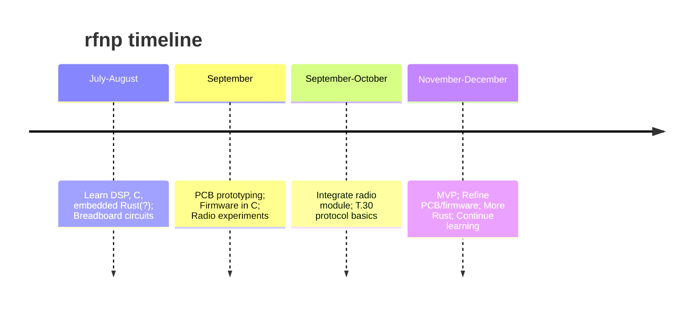

## Docs
This is where I'll be documenting everything about this project. There (will) exist the following folders:

```
doc
├── README.md
└── research/ # <- documenting my approaches, will be compiled into a blog post at the end
|   └── 0_initial.md
|   └── ...
|   └── setup.md 
└── dev/ # <- how to reproduce and develop (if I don't figure out a devcontainer or something)
|   └── ...
└── pcb/ # <- comments about the pcb design and hardware choices
    └── ...
```

## Progress & Timeline
Given my beginner status and full-time studies, here's a realistic (haha) timeline:


